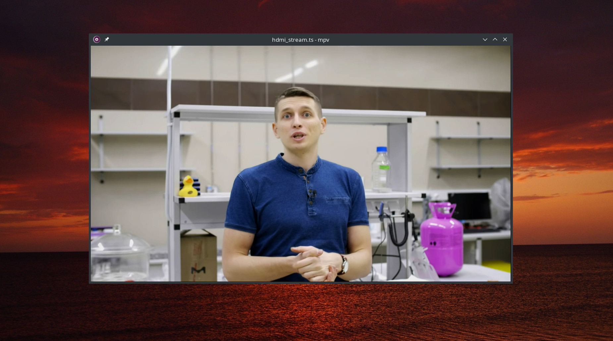

# IT9910HD FUSE FS

FUSE File System driver for IT9910HD HDMI MPEG4 (H.264) capture device.



## Limitations of current version

* Only one client can stream video (open video file) at the same time.
* Only sequential reads are supported (no file seeking). Works with `mpv` player or `cp` command.

## Setup USB permissions

1. Create or open `/etc/udev/rules.d/50-it9910hd_hdmi_grabber.rules` file.

2. Add new line:

```text
SUBSYSTEMS=="usb", ATTRS{idVendor}=="048d", ATTRS{idProduct}=="9910", GROUP="video", MODE="0666"
```

3. Restart or reload udev rules:

```bash
sudo udevadm control --reload
```

## Mount video filesystem

```bash
mkdir ./video
./it9910hd_fusefs ./video --width 1920 --height 1080 --fps 30 --bitrate 52000 --audio_src 2 --video_src 4
```

## Play video

```bash
mpv -hwdec=auto ./video/hdmi_stream.ts
```

## Record video

```bash
mpv -hwdec=auto --record-file=./video.ts ./video/hdmi_stream.ts
```

## Unmount file system

```bash
umount ./video
rmdir ./video
```
